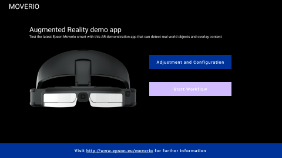
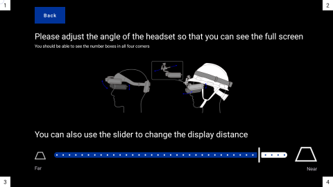
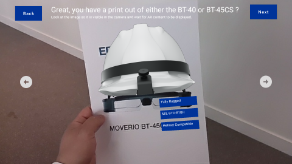
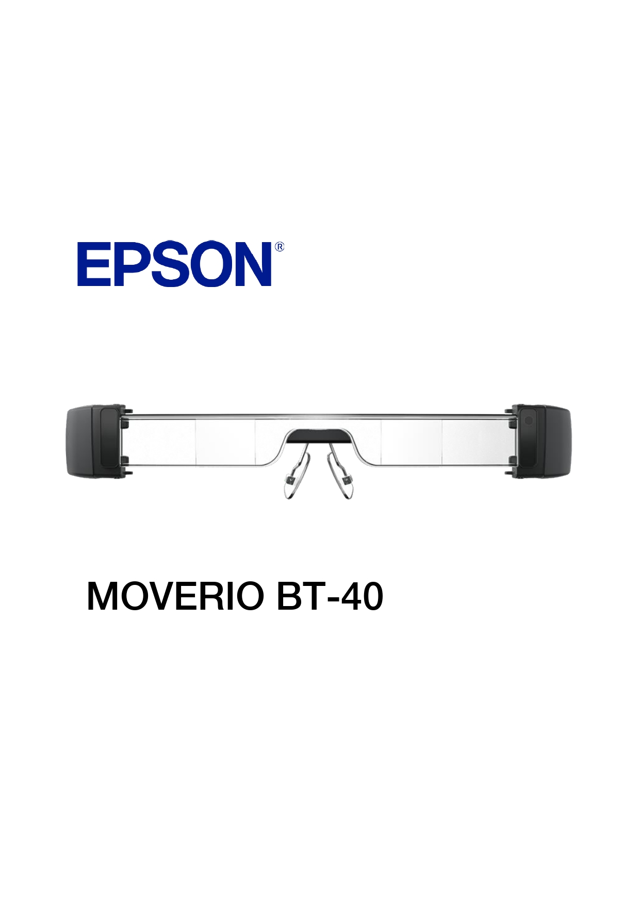
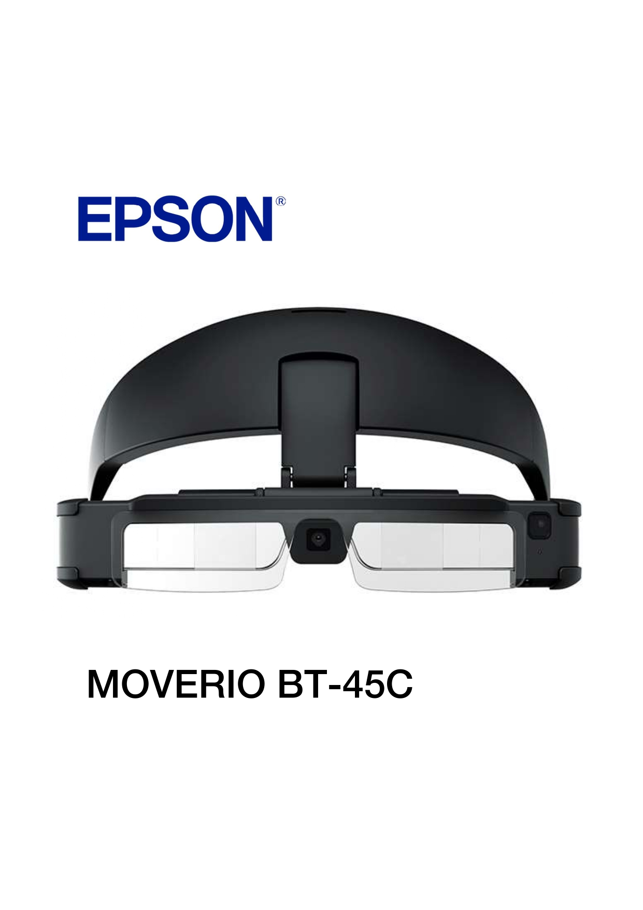

# Moverio AR Workflow

A step-by-step AR demo app designed for the Epson Moverio BT-45C smart glasses. Built using the MAXST AR SDK.

## Features

- AR Marker Detection
- Workflow Step Navigation
- Smart Glasses UI Showcase

---

## Screenshots

---

## AR Target Setup

The app is designed to detect specific images as AR markers. To try the full experience:

- Print or display the sample image targets included in the `assets/targets` folder
- Align the glasses’ camera with the marker to trigger AR content

---

## 📦 Download

You can download the latest build of the Moverio AR Workflow app below:

[👉 Download APK (v1.0)](https://drive.google.com/file/d/1Zi_XPIVU_ZX56I-iCgiZRqn7E81mnKfb)
